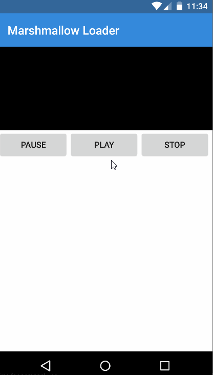

[](https://www.npmjs.com/package/nativescript-marshmallow-loader)
[](https://www.npmjs.com/package/nativescript-marshmallow-loader)

# NativeScript Marshmallow Loader
NativeScript plugin for the Android Marshmallow loading animation.
 
*Android Only*

## Sample Usage

Sample      |
------------|
 |

#### Native Library: 
Android |
---------- |
[Cleveroad/CRAndroidMBootAnimationView](https://github.com/Cleveroad/CRAndroidMBootAnimationView) |


## Installation
From your command prompt/terminal go to your app's root folder and execute:

`tns plugin add nativescript-marshmallow-loader`

## Usage

###
```XML
<Page 
  xmlns="http://schemas.nativescript.org/tns.xsd" 
  xmlns:Marshmallow="nativescript-marshmallow-loader" loaded="pageLoaded">
  <ActionBar title="Marshmallow Loader" />
  <StackLayout>
    <Marshmallow:MarshmallowLoader id="marshmallow" height="140" />
    <StackLayout orientation="horizontal">
      <Button text="Pause" tap="{{ pauseIt }}" />
      <Button text="Play" tap="{{ playIt }}" />
      <Button text="Stop" tap="{{ stopIt }}" />
    </StackLayout> 
  </StackLayout>
</Page>
```

## API

- **startAnimation()** - start playing the video
- **pauseAnimation()** - pause the video
- **stopAnimation()** - stop the animation and reset to beginning when resumed.